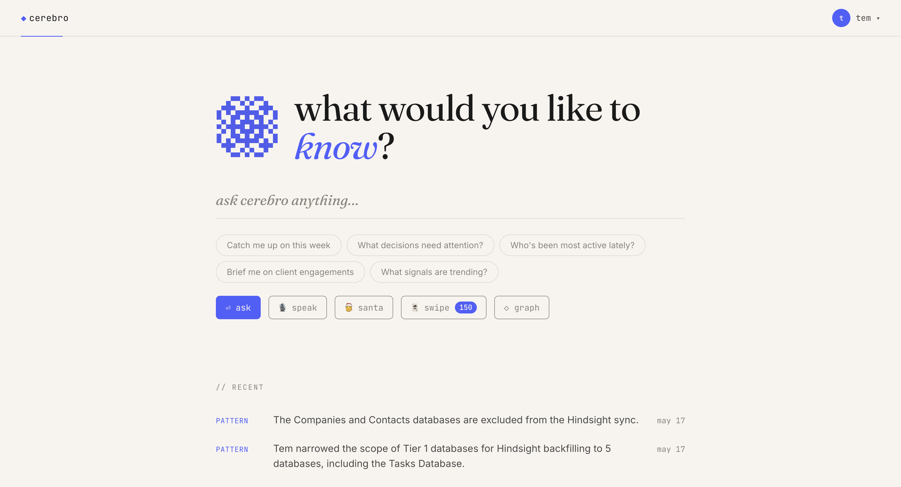
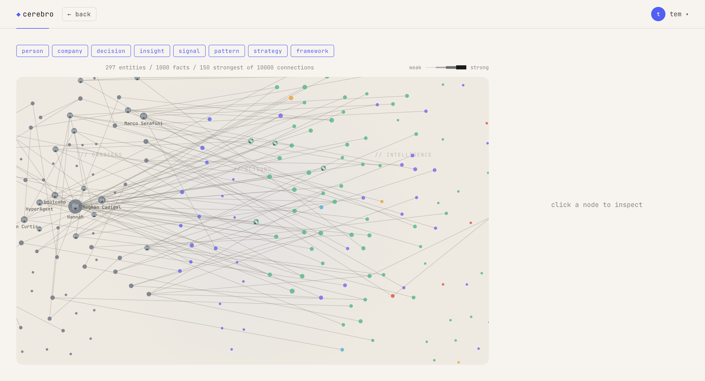
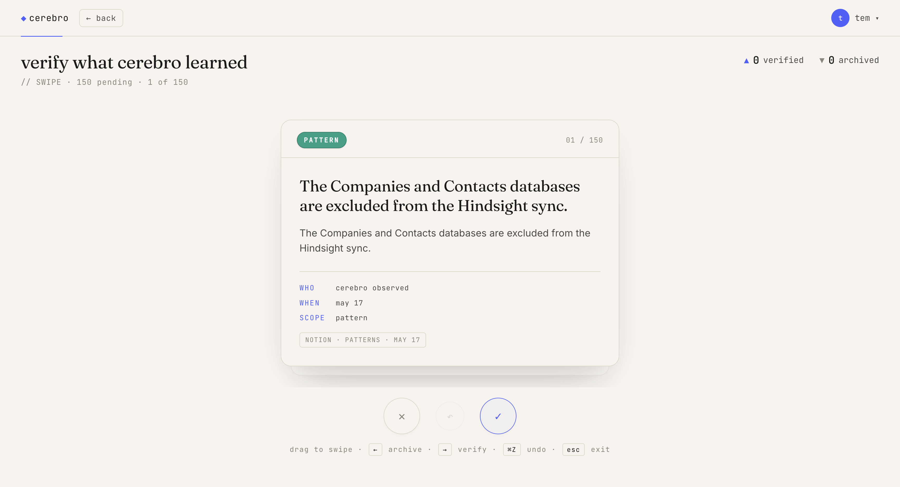
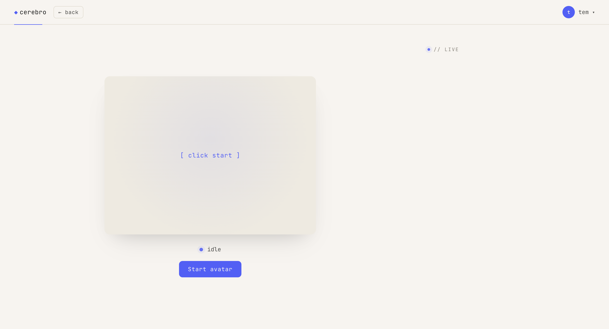
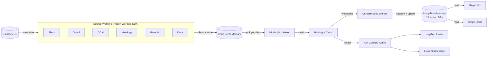

# Cerebro

**A nearly fully autonomous second brain for teams.**

The "second brain" framework has existed for almost a decade, but it's predicated on human entry, editing, and verification — a fundamentally flawed system. Cerebro proposes something different: automatic capture from every team surface, custom cleaning, distillation through a memory engine, and a fun interactive UI to explore it all. No manual entry. No human-in-the-loop structuring. Your org becomes legible to AI — and to you.

**[Live Demo](https://hackathon-cerebro.vercel.app/)** | [Full Spec](docs/specs/cerebro.md) | [Build Status](STATUS.md)

<p align="center">
  
  
</p>
<p align="center">
  
  
</p>

---

## How it works

Six **Notion Workers** pull data from Slack, Gmail, Google Calendar, meeting transcripts (Granola), and Notion Docs. Each worker cleans its input through a shared Glossary normalization library and writes cleaned text into a workspace-level **Short-Term Memory** database in Notion.

A **Hindsight Indexer Worker** polls Short-Term Memory and feeds new rows into [Hindsight Cloud](https://hindsight.vectorize.io) — a memory engine that handles fact extraction, entity resolution, and observation consolidation. A **Cerebro Sync Worker** writes structured records into **Long-Term Memory** — 13 Notion databases spanning dossiers (People, Companies, Agents), actions (Projects, Tasks, Decisions), intelligence (Insights, Frameworks, Strategies, Patterns, Signals), and measurement (Objectives, Metrics).

You interact with the knowledge through a **Decisions Interpreter** (a Notion Custom Agent with search, detail, impact, and trend analysis tools), a **force-directed graph visualization**, a **swipe deck feed**, a **HeyGen video avatar**, and **ElevenLabs voice chat** — all powered by **Claude** (Anthropic API) for reasoning.

Built on real Optemization team data. Dogfooded from day one.

## Architecture



## What's working

- **Slack Worker** — deployed, ingesting messages into Short-Term Memory
- **Google Worker** — Gmail + Google Calendar via domain-wide delegation (built, needs deploy)
- **Meetings Ingest Worker** — deployed, ingesting calendar meeting transcripts into STM
- **Granola Worker** — ingesting Granola.so meeting recordings into STM
- **Notion Docs Worker** — retains docs directly to Hindsight (bypasses STM)
- **Hindsight Indexer Worker** — polls STM, calls `retain()`, flips status to indexed/failed
- **Glossary Proposer Worker** — scans STM bodies, extracts entity candidates, proposes Glossary rows
- **Decisions Interpreter** — Notion Custom Agent with search/detail/impact/trends tools
- **Frontend** — feed, swipe deck, and graph viz wired to 12 Long-Term Memory DBs
- **Hindsight Cloud** bank bootstrapped (`optemization-cerebro`)
- **Ship workflow** — branch protection, auto-merge PRs, conventional commits

See [STATUS.md](STATUS.md) for the full build status.

## Tech stack

| Layer | Technology |
|---|---|
| App & API | Next.js (App Router), Vercel |
| Data workers | Notion Workers SDK |
| Custom Agents | Notion Custom Agents (Decisions Interpreter) |
| Memory engine | Hindsight Cloud (retain / recall / reflect) |
| Reasoning | Anthropic Claude API (Sonnet 4.6) |
| Video avatar | HeyGen LiveAvatar |
| Voice chat | ElevenLabs |
| Data store | Notion databases (no external DB) |

## Repo structure

```
cerebro/
  app/                    Next.js app (App Router)
    api/
      chat/               Chat endpoint (Claude reasoning)
      graph/              Hindsight graph data
      feed/               LTM feed
      deck/               Swipe deck
      ask/                Q&A endpoint
      liveavatar/         HeyGen session tokens
  lib/                    Shared libraries
    cleaning/             Glossary normalization library
    tools/                Notion Custom Agent tools
    skills/               Agent system prompts
  slack/                  Slack source worker
  google/                 Gmail + GCal source worker
  granola/                Granola meetings worker
  circleback/             Circleback meetings worker
  notion-docs/            Notion Docs source worker
  indexer/                Hindsight Indexer worker
  glossary-proposer/      Glossary entity proposer
  workers/
    meetings-ingest/      Meeting transcript ingest
    decisions-agent/      Decisions Interpreter (Custom Agent)
    documents-ingest/     Document ingest worker
    hindsight-indexer/    Hindsight indexer (alt location)
  docs/specs/cerebro.md   Full product spec
  STATUS.md               Current build status
  AGENTS.md               Agent-facing project guide
```

## Quick start

```bash
# App (Next.js)
npm install
cp .env.example .env      # fill in DB IDs + API keys
npm run dev                # http://localhost:3000

# Any worker
cd slack/                  # or google/, indexer/, etc.
npm install
cp .env.example .env       # fill in worker-specific env
ntn workers exec <capability> --local
```

## Team

Built at the [Notion Developer Platform Hackathon](https://cerebralvalley.ai/e/notion-developer-platform-hackathon) (May 16-17, 2026, San Francisco) by:

- **Tem** (Temirlan Nugmanov) — Architecture, workers, Hindsight integration
- **Kamau** — Frontend, graph viz, swipe deck
- **Mike** — Workers, data pipeline

[Optemization](https://optemization.com) — a Notion consultancy for mid-market and enterprise companies.
