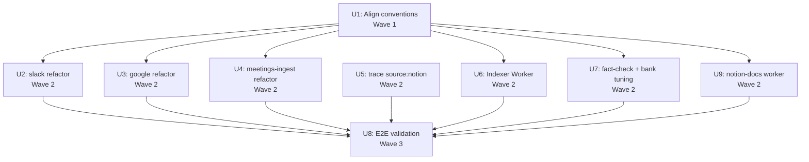

# feat: STM → Hindsight ingestion pipeline produces useful extractions across all sources

## Overview

The Cerebro pipeline currently has a transport problem ("we proved the wire works") but a content problem ("Hindsight extracts zero useful facts from calendar events"). This plan fixes the pipeline end-to-end so each source data type (Slack, Gmail, Gcal, Meetings, Notion-Docs) lands in the Hindsight `Cerebro` bank as narrative content that produces useful extracted memory units. Three pieces of work:

1. **Source worker content hygiene** — slack/google/meetings-ingest stop embedding metadata blobs in the STM page body; metadata moves to dedicated Notion properties; body stays narrative-only.
2. **A production Indexer Worker** at `indexer/` that continuously bridges STM rows to Hindsight `retain()`. Phase-1 Minimum (one sync, one manual tool, sync-mode retain) — explicitly *not* the Approach C the original design described.
3. **Convention alignment** across Status values, bank/namespace names, and `Source` property type so the indexer doesn't silently exclude rows or fall through to inference.

Plus: trace the mystery 200 `source:notion` memory units already in the bank, and lightly audit the Hindsight bank config to match the cleaner content shape we'll be sending.

The plan is structured for **parallel session dispatch via orchestrate-execute** — 9 units across 3 waves, with Wave 2 containing 7 parallelizable units after one quick Wave 1 setup.

---

## Problem Frame

Two independent experiments today established the picture:

- **Transport works.** The CLI prototype at `scripts/prototype-indexer.mjs` successfully retained 2 STM rows into Hindsight Cloud (HTTP 200, async completed). `document_id` is a proper upsert key — confirmed by `scripts/test-hindsight-idempotency.mjs`: re-retaining the same `document_id` with different content cleanly replaces prior facts.
- **Content is broken.** Of the 2 calendar event documents we retained, Hindsight extracted **zero** memory units. Meanwhile a clean 3-sentence narrative test produced 2 high-quality `world` facts with rich entity recognition. Adversarial code review traced the root cause: source workers (slack, google, meetings-ingest) all embed a `## Metadata` markdown block into the STM page body — full of email addresses, opaque IDs, permalinks, section headers. The Indexer concatenates everything in the body into Hindsight's `content` field, so the extraction LLM sees mostly noise. For Slack the message text dominates, so extraction mostly works. For Gcal, "actual content" is ~5% of the body — and Hindsight extracts nothing.

The team needs all data types to extract well by the Sunday hackathon demo (≤24-36h from plan creation). Voice/avatar Q&A surfaces are downstream of this — they can only be as good as the bank's content quality.

Reference: `docs/specs/hindsight-indexer.md` (the focused upstream design, written earlier this session) and `docs/specs/cerebro.md` (broader Cerebro vision).

---

## Requirements Trace

- R1. STM rows with narrative content from each source (Slack, Gmail, Gcal, Meetings, Notion-Docs) produce ≥1 useful Hindsight memory unit per row (see origin: `docs/specs/hindsight-indexer.md` §"In scope").
- R2. The Indexer Worker continuously bridges STM `Status = cleaned` rows to Hindsight `retain()` on a 5-minute schedule, flipping Status to `indexed` on success and `failed` on error.
- R3. All source workers, the spec, and the Indexer agree on one Status convention. Today three exist (slack/google: `cleaned`; meetings-ingest: unset; spec: `pending`).
- R4. Indexer is idempotent — re-running over the same row safely upserts in Hindsight (validated by `scripts/test-hindsight-idempotency.mjs`).
- R5. Source workers write **cleaned narrative content only** to the STM page body. Metadata (sender, channel, IDs, permalinks, attendees) lives in dedicated Notion properties so the Indexer doesn't feed it into Hindsight's `content` field.
- R6. The 200 existing `source:notion` memory units in the Cerebro bank have a documented origin path. Decide whether to preserve, integrate, or rebuild via a proper Notion-Docs source worker.
- R7. End-to-end validation report exists showing memory-unit count + extracted entity quality per data type. This is the acceptance test.
- R8. Hindsight bank config (mission, entity_labels, mental_models) reviewed for alignment with the cleaned content shape; tuned where obvious.

---

## Scope Boundaries

- Sync Worker (reads facts back from Hindsight → writes Long-Term Memory) — not in this plan.
- Ask Cerebro custom agent / `askCerebro` tool / `/api/ask` endpoint — not in this plan.
- Tavus avatar / ElevenLabs voice surface / graph viz — not in this plan.
- Cerebro Distiller agent — not in this plan.
- Notion-Docs *source worker* implementation — only its investigation (U5). Building the worker is deferred unless U5 determines it's needed for the demo.
- Hindsight `consolidation.completed` webhook handling — out of scope (the Sync Worker would own this).

### Deferred to Follow-Up Work

- **Indexer retry sync (`indexerRetry`)**: Approach C in the design doc specifies a separate retry sync with backoff + `Retry count < 5` filter + STM schema migration. Phase-1 Minimum drops this; `reindexStmRow` manual tool covers the immediate need. Re-introduce in V1.1 once we have real failure-mode data.
- **STM schema additions (`Failed reason`, `Retry count`)**: tied to retry sync above; deferred.
- **Backfill of historic STM rows**: focus the demo on fresh data flowing in. Historic backfill is a one-shot script that can run post-demo using the same `reindexStmRow` mechanism.

---

## Context & Research

### Relevant Code and Patterns

- `scripts/prototype-indexer.mjs` — validated working prototype. Treat as the implementation reference for U6 (Indexer Worker) row-processing logic. ~280 lines, covers STM query, body extraction, tag building, Hindsight retain call, response handling.
- `scripts/test-hindsight-idempotency.mjs` — verified upsert semantics. Provides a template for the validation script in U8.
- `scripts/setup-hindsight.mjs` — bank bootstrap script. Pattern for U7 (idempotent config tuning via PATCH `/config`).
- `slack/src/index.ts` — canonical Notion Workers SDK scaffold. Pattern for U6's worker shape (`worker.sync()`, `worker.tool()`, `worker.database()` shim). Also the source-worker template U2 refactors.
- `slack/CLAUDE.md` — Notion Workers SDK guide. Covers pacers, sync strategies, deployment commands.
- `google/src/index.ts` — Gmail + Gcal source worker. Pattern for U3 (similar body-cleanup refactor with two data type paths).
- `workers/meetings-ingest/src/index.ts` — meetings worker. The shortest source worker (~291 lines), pattern for U4. Notably does not write Status today.

### Institutional Learnings

No `docs/solutions/` directory in this repo yet. Insights captured in this session are recorded inline in `docs/specs/hindsight-indexer.md` and the prototype scripts.

### External References

- Hindsight Cloud OpenAPI spec at `https://api.hindsight.vectorize.io/openapi.json` — confirmed during this session. Retain endpoint is `POST /v1/default/banks/{bank_id}/memories` (not `/retain`). Body shape is `{ items: [MemoryItem], async: boolean }`. Namespace literally `default`. RecallRequest takes `tags` + `tags_match` for filtering.
- `docs/specs/hindsight-configuration.md` — per-call parameter semantics (`context`, `timestamp`, `document_id`, `tags`, `entities`, `observation_scopes`).

---

## Key Technical Decisions

- **Canonical Status value:** `cleaned` (matches what slack + google already write; meetings-ingest needs a 1-line patch; cheaper than migrating two workers). Spec at `docs/specs/cerebro.md` lines 187, 379, 587 must be updated from `pending` → `cleaned`. Rationale: minimum migration cost; reflects shipped reality.
- **Canonical bank + namespace:** `Cerebro` + `default` (matches what's actually working today; the spec's aspirational `optemization-cerebro` is not how the bank was provisioned). Update `.env.example` if drift remains.
- **`document_id` source:** STM `ID` property value (set by source workers; visible in the Notion `ID` column). Falls back to Notion page ID if empty. Rationale: human-visible cross-reference between Notion and Hindsight UIs.
- **Retain mode:** `async: false` (sync). Per-row latency ~3s — acceptable for a 5-minute cron worker. Lets the Indexer flip Status to `indexed` only after Hindsight has actually extracted, closing a downstream Sync-Worker gap. Rationale: honesty over speed.
- **Indexer scope:** Phase-1 Minimum (one delta sync, one manual reindex tool, no retry sync, no STM schema migration). Rationale: hackathon time pressure; the retry sync solves problems we don't have observed evidence for; `reindexStmRow` is the manual escape hatch.
- **Source worker body hygiene:** cleaned narrative content goes in the page body; structured metadata moves to dedicated rich_text properties (`Metadata` JSON blob OR specific properties like `SenderEmail`, `Permalink`, `ChannelName`). Each source worker chooses the shape that fits its data, as long as the body is narrative-only. Rationale: Hindsight extraction quality is gated by content noise ratio.
- **`Source` property type:** select (matches `docs/specs/cerebro.md` STM schema at line 185, with values Slack / Granola / Circleback / GMail / GCal / Notion). Indexer reads via `getSelect()`, falls back to inference only when the select is unset. Rationale: aligns spec and code with what STM actually is.
- **Validation as acceptance test:** U8 runs the prototype across all data types post-refactor and produces a report. Demo readiness gate. Rationale: extraction quality is invisible until you query for memory units; need an artifact.

---

## Open Questions

### Resolved During Planning

- Should we use sync or async retain in the Indexer? — **Sync.** 3s per row is fine, and honest Status semantics matter for the Sync Worker downstream.
- Approach C vs Phase-1 Minimum? — **Phase-1 Minimum.** Retry sync + STM schema migration deferred to V1.1.
- Status value: `cleaned` or `pending`? — **`cleaned`** (matches existing implementations).
- Bank ID: `Cerebro` or `optemization-cerebro`? — **`Cerebro`** (matches the actual provisioned bank).
- Should source workers write a single `Metadata` rich_text property (JSON) or dedicated typed properties? — **Implementer's choice per source.** Both work. The constraint is "body is narrative-only"; the metadata shape is flexible.

### Deferred to Implementation

- Whether Gcal events should index at all — depends on whether U3 can build a narrative form ("Meeting: X with attendees Y, organized by Z, scheduled W") that Hindsight finds extractable. If the narrative form produces zero facts, mark Gcal rows with `Status: skipped` and exclude them. Decision happens inside U3 after one validation run.
- Whether U5 (source:notion trace) discovers a worker we should integrate or content we should rebuild. If integrate: a follow-up plan for a Notion-Docs source worker. If rebuild: a one-shot script. Decision happens inside U5.
- Exact `Metadata` JSON shape per source worker — implementer's choice; the constraint is "body is narrative-only, metadata is structured."
- Whether to seed `PERSON_SOURCE_SLUGS` map for the current team or use Notion user IDs directly as slugs — implementer can pick based on what looks cleanest in extracted facts.

---

## Output Structure

```
indexer/
├── package.json              # @notionhq/workers, @notionhq/client@^5
├── tsconfig.json
├── workers.json              # generated by ntn
├── .env.example
├── README.md
└── src/
    └── index.ts              # worker definition + sync + tool, ~250 LOC

notion-docs/                  # NEW source worker (U9)
├── package.json              # @notionhq/workers, @notionhq/client@^5
├── tsconfig.json
├── workers.json              # generated by ntn
├── .env.example              # NOTION_API_TOKEN, NOTION_DOCS_DB_ID
├── README.md
└── src/
    └── index.ts              # worker.sync over Docs DB → STM, ~200 LOC

docs/plans/
└── 2026-05-17-001-feat-stm-hindsight-pipeline-plan.md   # this file

docs/research/                # may not exist yet — U5 creates if needed
└── source-notion-trace.md    # output of U5 investigation

# Modified (no new structure):
slack/src/index.ts            # U2 — body refactor
google/src/index.ts           # U3 — body refactor for Gmail + Gcal
workers/meetings-ingest/src/index.ts  # U4 — body refactor + Status write
scripts/setup-hindsight.mjs   # U7 — bank config tuning
scripts/prototype-indexer.mjs # U1 — Status filter update; U8 — --data-type flag
docs/specs/cerebro.md         # U1 — Status convention alignment
docs/specs/hindsight-indexer.md  # U1 — slim to Phase-1 Minimum
.env.example                  # U1 — bank/namespace value
```

---

## High-Level Technical Design

> *This illustrates the intended approach and is directional guidance for review, not implementation specification. The implementing agent should treat it as context, not code to reproduce.*

**Dependency graph (Mermaid):**



**Per-row data flow** (the Indexer's runtime shape):

```
STM row (Status: cleaned)
  │
  ▼ indexerDelta sync picks it up
processStmRow(notion, pageId)
  │
  ├─ readStmRow → { stmId, dataType, source, personSourceSlug, createdTime, bodyText, entities, ... }
  ├─ buildTagsForRow → ["team:optemization", "source:slack", "data-type:slack-message", "stm:<id>", ...]
  ├─ buildContextForRow → "Slack message from Slack by Tem"
  ├─ pacer.wait()
  ├─ callHindsightRetain({ items: [{ content, document_id: stmId, tags, context, timestamp, entities }], async: false })
  │     ├─ HTTP 200 → flipStatus(pageId, "indexed")
  │     └─ HTTP 4xx/5xx → flipStatus(pageId, "failed"), log error
  └─ console.log({ stmId, pageId, durationMs, outcome })
```

**Source worker body refactor pattern** (applied in U2/U3/U4):

```
BEFORE (today):
  Notion page body markdown =
    ## Message
    <content>
    ---
    ## Metadata
    - ID: ...
    - From: ...
    - Channel: ...

AFTER (target):
  Notion page body markdown = <content>   (narrative only, no headings, no metadata)
  Notion properties = {
    "Metadata":   rich_text(JSON.stringify({ id, from, channel, ... }))
                  OR dedicated typed properties
  }
```

The Indexer's `readBlockText` then produces clean narrative content for Hindsight's `content` field, unchanged from prototype logic.

---

## Implementation Units

- U1. **Align canonical conventions across spec, env, prototype**

**Goal:** Resolve the three convention drifts that block Wave 1 from being correct: (a) Status value (`cleaned` everywhere, no more `pending`), (b) bank + namespace (`Cerebro` + `default`), (c) `Source` property type (select, not rich_text in any reader).

**Requirements:** R3.

**Dependencies:** None (Wave 0).

**Files:**
- Modify: `docs/specs/cerebro.md` (lines mentioning `pending` Status — convert to `cleaned`; also confirm `Source` is documented as select)
- Modify: `docs/specs/hindsight-indexer.md` (slim from Approach C to Phase-1 Minimum: remove retry-sync sections, remove STM schema migration sections, keep `reindexStmRow` tool, update Status filter language to `cleaned`)
- Modify: `scripts/prototype-indexer.mjs` (the `Source` reader at the `buildRowShape` function — switch from `getRichText("Source")` to `getSelect("Source")` with inference fallback only when select is null)
- Modify: `.env.example` (root + worker-level) — confirm `HINDSIGHT_BANK_ID=Cerebro` and `HINDSIGHT_NAMESPACE=default` are canonical; remove or correct any references to `optemization-cerebro`
- Modify: `scripts/setup-hindsight.mjs` (BANK_ID default should match `.env.example`)

**Approach:**
- Single-session sweep: open each file, apply the conventional value, commit each file's change with a focused message.
- Source workers (`slack/src/index.ts`, `google/src/index.ts`) already write `Status: cleaned` — no change there. `workers/meetings-ingest/src/index.ts` is U4's responsibility, not this unit's.
- For `Source` property type: this unit only changes the *reader* in the prototype. Source workers writing `Source` (none do today) come later if needed.

**Patterns to follow:**
- `scripts/prototype-indexer.mjs` already has a `getSelect()` helper used for `Data Type`. Apply the same pattern to `Source`.

**Test scenarios:**
- Edge case: run the prototype with `--limit 2 --dry-run` after edits; verify it still picks up rows (Status filter unchanged) and the rendered tags still include `source:gcal` (inference path still works because no row writes `Source` yet).
- Happy path: grep for `pending` across `docs/specs/` and `scripts/` — should return zero hits referring to Status.
- Happy path: grep for `optemization-cerebro` across the repo — should only appear in historical comments or be removed entirely.

**Verification:**
- The prototype runs end-to-end with the new `getSelect("Source")` reader without errors.
- A reviewer reading `docs/specs/hindsight-indexer.md` cold understands Phase-1 Minimum is the chosen scope and Approach C is deferred to V1.1.

---

- U2. **Refactor `slack/src/index.ts`: clean body + metadata in properties**

**Goal:** Slack worker writes only the cleaned message text to the STM page body. All metadata (Slack user ID, channel, permalink, team ID, workspace name, thread parent, timestamp) moves into structured Notion properties so the Indexer doesn't feed metadata into Hindsight's content field.

**Requirements:** R5, R1.

**Dependencies:** U1.

**Files:**
- Modify: `slack/src/index.ts` (functions `upsertSlackMessage` and the `markdown` construction around lines 136-146)

**Approach:**
- Today's markdown has `## Message → <content> → --- → ## Metadata → bullet list`. After refactor: markdown is just the cleaned text content; everything in the `## Metadata` block migrates to Notion properties.
- Implementer's choice: either (a) one rich_text property `Metadata` holding `JSON.stringify({...})` of the whole metadata object, or (b) dedicated typed properties (`Permalink`, `SenderEmail`, `ChannelName`, `ChannelID`, `ThreadTs`, `WorkspaceName`). Prefer (b) where Notion native types are useful (`Permalink` as a URL field, etc.); use `Metadata` JSON blob for the long tail.
- Preserve the existing `ID`, `Name` (title), `Data Type`, `Status: cleaned`, and `Person Source` properties unchanged.
- Backfill consideration: existing slack STM rows have the old body shape. The Indexer's `reindexStmRow` tool will re-process them once they're flipped back to `Status: cleaned` — but they'll re-extract the still-polluted bodies. Decision: leave existing rows alone (they're already in Hindsight with whatever facts they produced); the refactor applies only to newly-ingested rows from this point forward. Optional: a one-shot script to re-fetch source data and rewrite N rows with the new shape; defer unless demo needs it.

**Patterns to follow:**
- The slack worker's existing `properties` object construction at line 178-186 — extend with the new property keys.
- Notion API rich_text property shape: `{ rich_text: [{ type: "text", text: { content: "..." } }] }`.

**Test scenarios:**
- Happy path: trigger `slackDelta` against a known channel; verify a newly-ingested row has narrative-only body content and populated `Permalink`/etc. properties.
- Edge case: a Slack message with empty `text` (file-share-only message) should still produce a row with sensible metadata properties but a body that's literal empty string or a one-token placeholder (NOT `_(no text content)_`, which would still pollute extraction).
- Edge case: a user mention in the message text — verify `cleanSlackText` still resolves it to `@displayname` and the resolved name appears in the cleaned body.
- Integration: after ingest, run `node scripts/prototype-indexer.mjs --page-id <new-row-id>` and verify the retain payload's `content` field is narrative-only (no `Metadata`, no `Channel:`, no opaque IDs).

**Verification:**
- A newly-ingested Slack STM row's body, read via `notion.blocks.children.list`, is just narrative text. Hindsight `content` will be the cleaned message text only.
- Existing properties (`ID`, `Name`, `Data Type`, `Status`, `Person Source`) are unchanged.
- New properties (whatever shape the implementer chose) are populated.

---

- U3. **Refactor `google/src/index.ts`: clean body + metadata in properties (Gmail + Gcal paths)**

**Goal:** Google worker writes only narrative content to STM body for both Gmail (email body) and Gcal (event description / synthesized event narrative) paths. Metadata moves to properties. For Gcal specifically: decide whether to build a narrative form so events extract usefully, or skip indexing them entirely.

**Requirements:** R5, R1.

**Dependencies:** U1.

**Files:**
- Modify: `google/src/index.ts` (Gmail upsert path and Gcal upsert path, including the metadata-rendering helpers around lines 247-261 and 295-309)

**Approach:**
- **Gmail path:** body = cleaned email plaintext (or HTML stripped to text). Metadata properties: `SenderEmail`, `RecipientEmails`, `Subject`, `MessageID`, `ThreadID`, `LabelIDs`. Subject can stay in `Name` (title). Preserve `Status: cleaned`.
- **Gcal path:** here's the real decision. Today the body is `Summary\n\n<title>\n\nDescription\n\n<desc>\n\nMetadata\n\nID:...Owner:...Calendar ID:...Event ID:...Start:...End:...Organizer:...Link:...Attendees:...`. Two options:
  - Option A: **narrative form.** Body becomes `"<title>" — a calendar event on <start time>, organized by <organizer>, with attendees <names>. <description if non-empty>.` This is one sentence per event. Test whether Hindsight extracts useful facts from this. Time: 30 min to refactor + 5 min validation.
  - Option B: **skip indexing.** Source worker writes `Status: skipped` (or doesn't write Status at all, since Indexer filters on `cleaned`). Gcal rows are visible in STM but never retained. Time: 5 min.
  - **Recommendation: try A first. If 1-2 sample events still produce zero memory units, fall back to B.** Document the decision in the worker file as a comment.
- Metadata properties for Gcal: `CalendarID`, `EventID`, `OrganizerEmail`, `AttendeeEmails` (rich_text JSON or multi-select), `EventStart` (date), `EventEnd` (date), `EventLink` (URL).
- Preserve existing properties (`ID`, `Name`, `Data Type`, `Person Source`).

**Patterns to follow:**
- U2's slack refactor (when complete) will set the precedent for property-shape choices. If U2 picks dedicated properties, mirror that here.
- Existing `renderEvent` and `renderEmail` helpers in `google/src/index.ts` — refactor in place, don't introduce a parallel path.

**Test scenarios:**
- Happy path Gmail: ingest a known email; verify body is narrative; verify `SenderEmail`, `Subject`, etc. populated; run `node scripts/prototype-indexer.mjs --page-id <id>`; verify Hindsight memory units extracted (≥1).
- Happy path Gcal (Option A narrative form): ingest a known event with a description and attendees; verify body reads as a single narrative sentence; verify property fields populated; verify Hindsight extracts ≥1 memory unit.
- Edge case Gcal: an event with no description and no attendees — does the narrative form still extract anything? If not, this is the trigger to fall back to Option B for events meeting that profile.
- Edge case Gmail: empty email body (`_(empty body)_` sentinel currently). Either skip-write to STM entirely, or write a meaningful placeholder. Don't write `_(empty body)_` since it pollutes extraction.
- Integration: after Gcal refactor + Indexer run (U6 done or via prototype), count memory units tagged `source:gcal` in the bank. Was zero before. Now should be ≥ N where N matches the test event count.

**Verification:**
- Gmail STM rows have narrative bodies; Hindsight memory units exist tagged `source:gmail`.
- Gcal: either (A) narrative bodies + Hindsight memory units tagged `source:gcal` exist, or (B) Gcal rows are marked `Status: skipped` and explicitly not indexed.

---

- U4. **Refactor `workers/meetings-ingest/src/index.ts`: clean body + write Status: cleaned**

**Goal:** Meetings-ingest worker writes (a) the clean meeting transcript / summary as the STM body, and (b) `Status: cleaned` on row creation. Without (b), the Indexer's Status-filter excludes every meeting row.

**Requirements:** R5, R1, R3.

**Dependencies:** U1.

**Files:**
- Modify: `workers/meetings-ingest/src/index.ts` (page-creation logic around lines 148-152 where properties are written; body construction wherever it builds the markdown).

**Approach:**
- Add `Status: { select: { name: "cleaned" } }` to the properties object on row creation.
- Refactor body: today the body includes any metadata sections the worker writes. After refactor: body is the meeting summary and/or transcript content only. Metadata (calendar event ID, meeting URL, attendees, organizer, start time) moves to dedicated properties matching the convention U3 establishes for Gcal events.
- If the meeting transcript is very long (>2000 chars per Notion rich_text block), the SDK should already handle chunking via the `markdown` field shorthand — verify no nested-block trap.
- Confirm body extraction in the Indexer (which uses `notion.blocks.children.list` with top-level walk only) sees the full transcript. If the SDK creates nested children for long content, U6 needs recursion (flag for the U6 implementer; doesn't block U4).

**Patterns to follow:**
- `slack/src/index.ts` line 182 `Status: { select: { name: "cleaned" } }` — copy this shape.
- U3's Gcal refactor for property naming consistency (since meetings often correspond to calendar events).

**Test scenarios:**
- Happy path: trigger the meetings-ingest worker; verify a newly-ingested row has `Status: cleaned`, narrative body, populated metadata properties.
- Edge case: a meeting with no transcript (placeholder row before transcript arrives). Either skip-write to STM, or write `Status: cleaned` with body marked as `Pending transcript` (the latter risks polluting Hindsight; prefer the former).
- Integration: after ingest, the Indexer's STM filter (which is `Status = cleaned`) picks up the new meeting row.

**Verification:**
- Newly-ingested meeting rows have `Status: cleaned`.
- Body is narrative (transcript or summary) only.
- The Indexer picks up the row and produces ≥1 Hindsight memory unit per meeting.

---

- U5. **Trace the 200 `source:notion` memory units in the Cerebro bank**

**Goal:** Find what script/worker/manual run produced the 200 existing high-quality `source:notion`-tagged memory units already in the Cerebro Hindsight bank. Document the path. Decide whether to integrate into the production pipeline, preserve as-is, or rebuild via a proper Notion-Docs source worker.

**Requirements:** R6.

**Dependencies:** None (Wave 1, read-only investigation).

**Files:**
- Create: `docs/research/source-notion-trace.md` — investigation report with findings, recommended action, links to source if found.
- Read-only: git history (`git log --all --oneline -- scripts/ slack/ google/ workers/`), local pulse-logs, any draft scripts, Slack history if relevant.

**Approach:**
- Tactical investigation. Look at the 200 memory units' tags + `chunk_id` pattern (the earlier inspection showed `chunk_id: "Cerebro_363a4866-2b25-817f-88ad-eeb16b260212_0"`) — the leading 32-char hex is a Notion page ID. Pull those page IDs from STM (or directly from Notion) to see what database/page they live in.
- Check git log for any script that calls Hindsight's retain endpoint with `source:notion` or `data-type:documents` tags. Likely candidates: a prior `scripts/seed-*.mjs`, an early prototype, or `scripts/setup-hindsight.mjs` if it ever loaded sample content.
- Check the Notion-Docs database referenced in `docs/specs/cerebro.md` line 375 (`https://www.notion.so/optemization/7770dd47209b49098dad46ec0d4dcb3b`). If the page IDs in the chunk_ids match docs from that database, we know the source. Possibly a script someone ran locally.
- Three decisions in the report:
  - **Preserve:** leave the 200 units in place; the demo can rely on them. Risk: nobody knows how to re-create them. Acceptable for the hackathon.
  - **Integrate:** build a Notion-Docs source worker (follow-up plan, not this one). Triggered if U5 reveals there's actively-changing notion-docs content that needs continuous indexing.
  - **Rebuild:** wipe and re-create via a one-shot script (this plan can include a small `scripts/seed-notion-docs.mjs`). Triggered if the 200 units are stale, partial, or have outdated content.
- Write the report's recommendation; defer execution of any "integrate" decision to a follow-up plan.

**Patterns to follow:**
- N/A (investigation work). Output is a markdown report.

**Test expectation:** none — investigation unit, no behavioral change ships from this unit. The report is the deliverable.

**Verification:**
- `docs/research/source-notion-trace.md` exists with: where the 200 memory units came from (or what we know about them), recommended action (preserve / integrate / rebuild), and rationale.
- If the recommendation is "rebuild": a follow-up implementation unit added to this plan (post-hoc) or a separate plan filed.

---

- U6. **Build production Indexer Worker at `indexer/` (Phase-1 Minimum)**

**Goal:** Production Notion Worker that bridges STM `Status = cleaned` rows to Hindsight retain on a 5-minute schedule. Phase-1 Minimum scope: one `indexerDelta` sync, one `reindexStmRow` manual tool, sync-mode retain, NO retry sync, NO STM schema migration.

**Requirements:** R2, R4. Indirectly supports R1, R7.

**Dependencies:** U1.

**Files:**
- Create: `indexer/package.json` (@notionhq/workers, @notionhq/client@^5)
- Create: `indexer/tsconfig.json` (copy from slack/)
- Create: `indexer/.env.example` (HINDSIGHT_* + NOTION_API_TOKEN)
- Create: `indexer/README.md` (setup + ntn commands + deployment runbook)
- Create: `indexer/src/index.ts` (~250 LOC; worker definition + sync + tool)
- Test: smoke tests via `ntn workers exec` (no separate test file)

**Approach:**
- Mirror `slack/`'s scaffold. Each capability in `src/index.ts`:
  - `worker.database("indexerSyncShim", ...)` — scheduler hook only, never written. Same trick as slack's `slackSyncShim`.
  - `worker.pacer("hindsightApi", { allowedRequests: 10, intervalMs: 1000 })` — conservative starting rate.
  - `worker.sync("indexerDelta", { database: indexerSyncShim, schedule: "5m", mode: "incremental", execute })` — queries STM for `Status = cleaned`, processes up to 50 rows per cycle, returns `{ changes: [], hasMore: false }`.
  - `worker.tool("reindexStmRow", { schema: { stmPageId }, execute })` — single-row reindex for manual use.
- The `processStmRow(notion, stmPageId)` helper is the row of trust. Source from `scripts/prototype-indexer.mjs` with these review-finding fixes applied inline:
  - Read `Source` property via `getSelect()`, not `getRichText()`.
  - Populate `PERSON_SOURCE_SLUGS` map with the current Optemization team's Notion user IDs (Tem, Kamau, Mike at minimum). Implementer fetches IDs via a small `notion.users.list()` call in setup, or hardcodes after one lookup.
  - Wrap `fetch` in `AbortController` with a 30s timeout.
  - `reindexStmRow` tool validates that the requested page's `parent.data_source_id === STM_DATA_SOURCE_ID`. Reject otherwise to prevent retaining arbitrary pages.
  - Set `async: false` on retain (sync mode). HTTP 200 means actually extracted; Status flip is honest.
  - On retain success: flip Status to `indexed`.
  - On retain failure: flip Status to `failed`, log the error message (in console; no STM property write since the schema migration is deferred).
- Pacer: 10 req/s shared. Delta processes up to 50 rows per cycle ≈ 5s at full rate. Well under the 5-min cron window.
- Body extraction (`readBlockText`) walks top-level blocks only (matches prototype). Flag for implementer: if any source worker ends up writing nested blocks (toggles, callouts), this needs recursion. Today none do.
- Deployment runbook in `indexer/README.md`:
  - `cd indexer && npm install`
  - `npm run check` (tsc --noEmit)
  - `ntn workers deploy`
  - `ntn workers env push` (push NOTION_API_TOKEN + HINDSIGHT_API_KEY + HINDSIGHT_* config)
  - `ntn workers sync status` — verify HEALTHY

**Patterns to follow:**
- `slack/src/index.ts` end-to-end (worker shape, sync shim, pacer, tool).
- `scripts/prototype-indexer.mjs` for the per-row processing logic.
- `slack/CLAUDE.md` for the Notion Workers SDK conventions, pacer guidance, sync strategies.

**Test scenarios:**
- Happy path: `ntn workers exec indexerDelta --local` against the deployed STM with a known `Status: cleaned` row. Status flips to `indexed`; Hindsight UI shows the document; recall by tag returns extracted memory units (because sync retain blocked until extraction).
- Happy path: `ntn workers exec reindexStmRow --local -d '{"stmPageId":"<known-id>"}'`. Single-row processes; output confirms success.
- Edge case: an STM row with `Status: cleaned` but empty body (a placeholder). Indexer logs a warning, skips (does NOT flip to indexed, leaves as-is for human review).
- Edge case: a row with `Status: cleaned` but missing `ID` property. Indexer falls back to using `page.id` as document_id and proceeds. (This catches the prototype's fallback path.)
- Error path: pass an invalid `HINDSIGHT_API_KEY` to the local exec; verify the row flips to `failed` with the error logged. (Don't run this against the deployed worker without resetting.)
- Error path: `ntn workers exec reindexStmRow --local -d '{"stmPageId":"<non-stm-page-id>"}'` — the tool rejects because the page's parent isn't the STM data source.
- Integration: deploy the worker, wait one 5-min cycle, verify the Notion `Status` column shows recent rows transitioning from `cleaned` → `indexed`.

**Verification:**
- The `indexerDelta` sync runs on schedule, processes available `Status: cleaned` rows, flips them to `indexed`.
- `reindexStmRow` tool works for manual re-processing.
- Hindsight bank gains memory units tagged with `stm:<id>` for each indexed row.
- `ntn workers sync status` shows `HEALTHY`.

---

- U7. **Fact-check Hindsight outputs + tune bank config**

**Goal:** Two-phase session: (a) **fact-check** what Hindsight has actually extracted — sample facts, observations, and mental-model outputs; mark each as correct / partial / wrong / unclear with human input; identify failure-mode patterns. (b) **tune** the bank config (mission, retain_mission, observations_mission, entity_labels, mental_models, dispositions) to address those failure modes. Fact-checking provides the signal; tuning closes the gap. Critical for demo trustworthiness — voice/avatar/Notion-agent surfaces read these outputs aloud, so accuracy matters more than throughput.

**Requirements:** R8.

**Dependencies:** U1. Soft dependency on U2/U3/U4/U9 results (more diverse cleaned content makes fact-checking more representative) — implementer can do an initial pass against the existing 200 `source:notion` units while Wave 2 is in flight, then expand the sample once more sources land.

**Execution note:** This session is **interactive** — the fact-check phase requires a knowledgeable human reviewer (default: Tem) to mark sample entries. The session should pause for human review at the fact-check phase rather than auto-mark. Allocate ~30-45 min of reviewer time on top of the session's autonomous work.

**Files:**
- Modify: `scripts/setup-hindsight.mjs` (the source of truth for the bank config; re-running PATCHes the live bank idempotently)
- Create: `docs/research/hindsight-accuracy-review-2026-05-17.md` (the fact-check review doc with samples + markings + aggregate findings)
- Modify (potentially): `docs/specs/cerebro.md` if the bank's "official" mission needs updating to match what we tune

**Approach:**

*Phase A — Sampling + fact-check (~1.5h autonomous + ~30-45min reviewer time):*

1. **Sample selection.** Pull representative content from the bank:
   - ~20-30 `world` facts: mix recent + older, distributed across `source:*` tags (slack, gmail, gcal, meetings, notion).
   - All `observation` units currently in the bank: synthesized patterns are higher-stakes than individual facts.
   - For each configured mental model (currently: team-state, open-decisions, client-engagements, rising-signals): run a `recall()` against its `source_query` and capture the output.
2. **Build review doc.** Create `docs/research/hindsight-accuracy-review-2026-05-17.md` (also optionally a Notion page for nicer UX) structured as:
   - Section per category (Facts / Observations / Mental Models)
   - For each entry: the extracted text, its tags, its entities, a checkbox-style marker (`[ ] correct / [ ] partial / [ ] wrong / [ ] unclear`), and a freeform "why" field
   - Aggregate counts at the top
3. **Reviewer fact-check.** Pause session; ask Tem (or designated reviewer) to mark each entry. Specifically watch for:
   - **Misattribution** ("Bob said X" when actually Carol did)
   - **Over-generalization** ("AIVC always uses approach Y" from one data point)
   - **Fabricated entities** (an "AIVC SharePoint consultant" that doesn't actually exist)
   - **Missing context** (a fact technically true but uselessly stripped of relevant nuance)
   - **Stale information** (correct at retain time but no longer true)
4. **Aggregate findings.** Once reviewer marks are in, categorize misses by failure mode. Identify patterns Hindsight is consistently getting wrong.

*Phase B — Tune based on findings (~1.5h):*

5. **Walk each config section and apply findings:**
   - **`mission` / `retain_mission` / `observations_mission`**: rewrite language where the fact-check surfaced systematic confusion (e.g., if Hindsight over-generalizes, strengthen "report only what's explicitly stated, not what's implied").
   - **`entity_labels`**: add/remove labels based on what Hindsight actually recognizes vs misses. Refine descriptions for labels that are mis-applied.
   - **`mental_models`**: re-run each query post-fact-check; if outputs are weak/wrong, refine the `source_query` text or add new models for gaps the team cares about.
   - **`dispositions`** (`skepticism`, `literalism`, `empathy`): if Hindsight is reading more confidence than the team has, bump `skepticism` and `literalism`. Currently `4, 4, 3` — adjust as evidence dictates.
6. **Re-run `scripts/setup-hindsight.mjs`** (idempotent) to apply changes to the live bank.
7. **Document before/after.** One section in the review doc: "Tuning applied based on fact-check findings: [enumerated changes]". Re-run one or two representative recall queries post-tuning to show the diff.

**Patterns to follow:**
- `scripts/test-hindsight-idempotency.mjs` for the recall + filter pattern.
- `scripts/setup-hindsight.mjs`'s existing structure — PATCH calls to `/config`, `/mental-models` are already idempotent. Just edit the constants at top of file.

**Test scenarios:**
- Happy path Phase A: review doc exists at `docs/research/hindsight-accuracy-review-2026-05-17.md` with ≥20 samples categorized.
- Happy path Phase B: re-running `npm run setup:hindsight` after edits applies the new config idempotently; no errors.
- Integration: a recall query that returned a marked-wrong answer pre-tuning produces a different (ideally better) answer post-tuning.
- Edge case: a mental model whose `source_query` returns nothing useful — re-write the query; verify the new query returns substantive results.
- Edge case: the fact-check reveals zero patterns (everything's correct) — that's a valid outcome; the deliverable is then "fact-check passed, no tuning needed, here's the audit trail."

**Verification:**
- Review doc exists with reviewer markings completed.
- Aggregate findings documented (failure-mode patterns or "nothing systematic found").
- Bank config tuned (or explicitly: "no tuning needed because findings show baseline is correct").
- Before/after recall example documented for at least one query.

---

- U9. **Build Notion-Docs source worker at `notion-docs/`**

**Goal:** New source worker that watches the Optemization Docs DB (`7770dd47209b49098dad46ec0d4dcb3b`), writes each non-archived doc as an STM row with cleaned content body + structured metadata properties. Closes the "Notion-Docs worker not started" gap (per STATUS.md). Formalizes the path that produced the 200 existing `source:notion` memory units.

**Requirements:** R1, R5, R6.

**Dependencies:** U1. Soft dependency on U5 (the source:notion trace findings inform whether to wipe + replace existing 200 units or coexist with them; the worker implementer can proceed with the default "build cleanly, coexist with existing units" assumption and adjust based on U5's report when available).

**Files:**
- Create: `notion-docs/package.json` (@notionhq/workers, @notionhq/client@^5)
- Create: `notion-docs/tsconfig.json` (copy from `workers/meetings-ingest/`)
- Create: `notion-docs/.env.example` (NOTION_API_TOKEN, NOTION_DOCS_DB_ID)
- Create: `notion-docs/README.md` (setup + deployment runbook)
- Create: `notion-docs/src/index.ts` (~200 LOC; worker.sync over Docs DB)
- Test: smoke tests via `ntn workers exec` (no separate test file)

**Approach:**
- Pattern after `workers/meetings-ingest/`: a `worker.sync` with incremental cursoring on `last_edited_time` over a Notion data source.
- Resolve the Docs DB to its data source ID via `notion.databases.retrieve` once during setup (or hardcode after one lookup).
- For each non-archived row: walk page blocks via `notion.blocks.children.list`, concat plain_text to assemble the doc's body content as cleaned narrative. Skip headings if they appear only as structural scaffolding (per the body-hygiene principle in U2/U3/U4).
- Write to STM with properties:
  - `Name` (title): the doc's title
  - `ID` (rich_text): deterministic hash, e.g. `uuidv5(\`notion-docs://${docPageId}\`, NOTION_DOCS_NAMESPACE_UUID)`
  - `Data Type` (select): `Document` (or whatever value the spec lands on)
  - `Source` (select): `Notion`
  - `Status` (select): `cleaned`
  - `Person Source` (people): the doc's primary owner (look up via `Created by` or a designated DRI property if the Docs DB has one)
  - `Verified` (checkbox or rich_text): `true` (per the spec's `verified:true` tag convention for Notion-Docs content)
- Skip archived rows (`Archived: true`) and re-sync on `last_edited_time` change.
- Configurable list of Docs DB IDs for multi-DB orgs (V1: just Optemization's single Docs DB; product scope supports more).

**Patterns to follow:**
- `workers/meetings-ingest/src/index.ts` — closest analog. Reads Notion Calendar DB, writes to STM. Same sync pattern, different source DB and Data Type.
- `slack/CLAUDE.md` for Notion Workers SDK conventions (incremental sync with state cursor, pacer for upstream API, body markdown shorthand).

**Test scenarios:**
- Happy path: trigger `notionDocsDelta` against the Optemization Docs DB; verify a known non-archived doc creates an STM row with narrative-only body and populated metadata properties.
- Happy path: pick the new STM row, run `node scripts/prototype-indexer.mjs --page-id <new-row-id>`, verify Hindsight extracts memory units tagged `source:notion`, `data-type:document`, `verified:true`.
- Edge case: an archived doc — verify worker skips it (no STM row created or updated).
- Edge case: a doc with empty body — either skip-write to STM, or write a `Status: skipped` row (don't write `_(empty body)_` placeholder).
- Edge case: a doc with deeply nested toggles/columns — verify body extraction either recurses (preferred) or flags the doc as "incomplete extraction" for follow-up.
- Integration: re-sync after editing a doc's content — verify the STM row's `last_edited_time`-based update triggers re-index (Indexer re-retains with the same `document_id`, upserting in Hindsight).
- Integration: after U6 (Indexer) is live + this worker is live, end-to-end check: edit a doc, wait ≤5 min, see the doc's facts re-extracted in Hindsight with updated content.

**Verification:**
- `notion-docs/` worker deploys via `ntn workers deploy`, `ntn workers sync status` shows HEALTHY.
- Non-archived rows in the Optemization Docs DB appear in STM with `Source: Notion`, `Status: cleaned`, `Verified: true`.
- The Indexer picks them up and produces Hindsight memory units tagged `source:notion`.
- Edits to a doc are re-synced and re-indexed (idempotent upsert in Hindsight).

---

- U8. **End-to-end validation across data types**

**Goal:** Run the prototype against representative rows from each source (Slack, Gmail, Gcal, Meetings, Notion-Docs) after all source-worker refactors + Indexer + bank tuning. Produce a "what extracts cleanly vs. what doesn't" report. This is the acceptance test for the entire plan.

**Requirements:** R1, R7.

**Dependencies:** U2, U3, U4, U5, U6, U7, U9.

**Files:**
- Modify: `scripts/prototype-indexer.mjs` (add a `--data-type "Slack message"` filter to query only rows of a given Data Type)
- Create: `docs/research/extraction-validation-2026-05-17.md` — the validation report

**Approach:**
- Extend `prototype-indexer.mjs` with a `--data-type <name>` flag. Filter the STM query by `Data Type select equals <name>`. Trivial addition to the existing `queryStmRows` function.
- Pick 3-5 representative rows per source type. Run the prototype to retain them (or rely on the Indexer having already retained them if U6 is live).
- For each, query Hindsight's `/memories/list` and filter by `stm:<id>` tag. Count memory units. Look at the extracted facts: are they accurate, well-attributed, with entities recognized?
- Write the report with sections per source type:
  - **Slack message**: N memory units per row on average. Sample extracted fact. Entity recognition quality. Decision: ✅ extraction works / ⚠️ partial / ❌ needs more work.
  - **Gmail message**: same.
  - **Gcal event**: same (or note "skip-indexed" if U3 chose Option B).
  - **Meeting transcript**: same.
  - **Notion document**: same (using existing `source:notion` units or new ones if U5 led to a rebuild).
- For any source that comes in `❌`: file a follow-up implementation unit (in this plan or a separate one) describing the gap.
- Final section: **demo readiness assessment** — can the Sunday demo lean on extracted facts to power the planned Q&A surfaces? If yes, ship. If no, name the specific gap.

**Patterns to follow:**
- `scripts/test-hindsight-idempotency.mjs` for the recall + filter pattern (the test already does this).
- The bash + curl + python3 patterns used elsewhere in this session's diagnostics.

**Test scenarios:**
- Happy path: run `prototype-indexer.mjs --data-type "Slack message" --limit 5`; verify all 5 rows process; verify ≥5 new memory units land in the bank tagged with their respective `stm:<id>`.
- Happy path: same for each other Data Type.
- Edge case: a Data Type that has no rows in STM (because U3 chose to skip-index Gcal). Verify the script reports "0 rows picked up" gracefully.
- Integration: recall by tag for each `stm:<id>` and confirm extracted facts are present.

**Verification:**
- `docs/research/extraction-validation-2026-05-17.md` exists with per-source quality assessment and a clear demo-readiness verdict.
- If verdict is "demo-ready": handoff complete.
- If verdict is "gap exists in source X": follow-up unit filed.

---

## System-Wide Impact

- **Interaction graph:** Touches three independently-deployed Notion Workers (slack, google, meetings-ingest), one new Notion Worker (indexer), one bootstrapper script (setup-hindsight). Each is an independent deployment lifecycle. The Indexer is the ONLY component reading from all three source workers' output simultaneously — a regression in any source worker's body shape silently degrades extraction quality.
- **Error propagation:** Source workers writing the wrong Status value (e.g., misspelling `cleaned` as `clean`) silently break the Indexer's filter. The Indexer flipping Status to `failed` on Hindsight error is recoverable manually via `reindexStmRow` after fixing the underlying issue. No retry sync exists yet (deferred to V1.1) so transient Hindsight outages require manual recovery.
- **State lifecycle risks:** STM rows can be in 4 states: (no Status set), `cleaned`, `indexed`, `failed`. The Indexer only acts on `cleaned`. If a future Sync Worker also acts on `indexed`, that's a separate state contract — outside this plan.
- **API surface parity:** The Indexer is the sole producer of Hindsight `retain` calls. Any future "Notion-Docs source worker" or "Slack thread re-ingest" would also need to write through STM, not directly to Hindsight. This is the architectural invariant.
- **Integration coverage:** End-to-end correctness depends on (a) source worker writing right Status + clean body, (b) Indexer running on schedule with sync retain, (c) Hindsight bank config tolerating the content shape. U8 is the integration test for the whole graph.
- **Unchanged invariants:** STM's data source ID (`362a4866-2b25-801c-9ce5-000b30156f9b`) does not change. STM's primary `ID`, `Name`, `Data Type`, `Person Source`, `Status` properties don't change shape (only Status *value* drifts during U1). Hindsight bank name (`Cerebro`) and namespace (`default`) don't change. Hindsight retain endpoint, request shape, response shape don't change.

---

## Risks & Dependencies

| Risk | Mitigation |
|---|---|
| **Source-worker refactor breaks existing STM rows for in-flight Slack/Gmail/Gcal/Meeting ingest.** | Each refactor adds properties + simplifies body — no existing property is removed. Existing rows stay readable. The Indexer's body-extraction still works on old rows (just lower-quality extraction). New rows benefit from the cleanup. |
| **Gcal narrative form (U3 Option A) still produces zero extractions.** | U3's test plan explicitly checks this. Fallback to Option B (skip-index) is documented and trivial. |
| **Indexer's 5-min schedule is too slow for the demo "watch it flip live" beat.** | Manual `reindexStmRow` tool gives sub-second feedback for the demo. Schedule can be flipped to `continuous` in `indexer/src/index.ts` if Hindsight rate limits allow (validate during U6). |
| **Hindsight Cloud rate-limits us during U8 validation (many retains across data types).** | Pacer at 10 req/s with sync retain ≈ 1 retain per ~3s effectively. U8 processes ~25 rows total; under 90 seconds at most. Well within plausible limits. If rate-limited: throttle by adding sleeps between sources. |
| **U5 (notion-docs trace) finds an actively-running worker we don't know about.** | The investigation report is the deliverable; integration with the production pipeline is a follow-up plan if needed. Doesn't block U8 — U8 can use the existing 200 units as the notion-docs sample. |
| **U1 misses a `pending` reference in the codebase or spec.** | A grep for `pending` after U1 lands is a final verification; documented in U1's test scenarios. |
| **Parallel sessions in Wave 1 step on each other's changes.** | All Wave 1 units modify *different* files (slack/, google/, workers/meetings-ingest/, indexer/, scripts/setup-hindsight.mjs, docs/research/). Each unit's changes are isolated by file. PR merge order doesn't matter. |
| **Sync-mode retain (3s/row) bottlenecks a large STM backlog after deploy.** | Acceptable for hackathon volume (~tens of rows). The Indexer's 5-min cycle processes up to 50 rows; at 3s each that's 150s = 2.5 min per cycle. Backlog catches up within a few cycles. Post-demo, can switch to async + operation_id polling. |

---

## Documentation / Operational Notes

- `indexer/README.md` is the primary operational doc — setup, deploy, debug commands.
- `docs/specs/hindsight-indexer.md` (slimmed by U1) remains the authoritative design doc. Update after Phase-1 ships if V1.1 work begins.
- `docs/research/source-notion-trace.md` (U5 deliverable) documents the notion-docs path.
- `docs/research/extraction-validation-2026-05-17.md` (U8 deliverable) is the demo readiness artifact.
- For the Sunday demo: the live demo can use `ntn workers exec reindexStmRow --local -d '{"stmPageId":"..."}'` to show a row flip in seconds. The 5-min schedule provides the "continuously running" backdrop.
- Post-demo cleanup: the 4 idempotency-test memory units in the bank (tagged `idempotency-test:*`) can be deleted via the Hindsight UI or `DELETE /memories/{document_id}` API.

---

## Sources & References

- **Origin document:** [docs/specs/hindsight-indexer.md](docs/specs/hindsight-indexer.md) (focused Indexer design, written earlier this session)
- **Broader vision:** [docs/specs/cerebro.md](docs/specs/cerebro.md) (Cerebro spec; STM schema, source workers, demo flow)
- **Hindsight configuration reference:** [docs/specs/hindsight-configuration.md](docs/specs/hindsight-configuration.md) (per-call parameter semantics)
- **Validated prototype:** [scripts/prototype-indexer.mjs](scripts/prototype-indexer.mjs)
- **Idempotency proof:** [scripts/test-hindsight-idempotency.mjs](scripts/test-hindsight-idempotency.mjs)
- **Bank bootstrap:** [scripts/setup-hindsight.mjs](scripts/setup-hindsight.mjs)
- **Hindsight Cloud OpenAPI:** `https://api.hindsight.vectorize.io/openapi.json`
- **Hindsight UI (live bank):** `https://ui.hindsight.vectorize.io/banks/Cerebro`
- **Notion Workers SDK guide:** [slack/CLAUDE.md](slack/CLAUDE.md)
- **Current build state:** [STATUS.md](STATUS.md)

---

## Execution Strategy

### Project prefix

`stm-hindsight-pipeline`

### Session DAG

```
Wave 1 (setup; 1 session, no parallelism)
  └─ 1.1 align-conventions (U1)

Wave 2 (refactor + investigation + new source worker; 7 sessions, all parallel; depends on 1.1)
  ├─ 2.1 refactor-slack-worker      (U2)   [depends on 1.1]
  ├─ 2.2 refactor-google-worker     (U3)   [depends on 1.1]
  ├─ 2.3 refactor-meetings-ingest   (U4)   [depends on 1.1]
  ├─ 2.4 trace-source-notion        (U5)   [no hard dep — read-only investigation]
  ├─ 2.5 build-indexer-worker             (U6)   [depends on 1.1]
  ├─ 2.6 fact-check-and-tune-hindsight-bank (U7) [depends on 1.1; interactive — needs reviewer time]
  └─ 2.7 build-notion-docs-worker         (U9)   [depends on 1.1; soft-dep on 2.4]

Wave 3 (acceptance test; 1 session, depends on all of Wave 2)
  └─ 3.1 validate-end-to-end        (U8)   [depends on 2.1–2.7]
```

### Session specs

- **Session 1.1 — align-conventions** (`stm-hindsight-pipeline · 1.1 · align-conventions`)
  - **U-ID:** U1
  - **Dependencies:** none
  - **In scope:**
    - Reconcile Status convention across spec + workers + prototype to `cleaned`
    - Align bank ID + namespace (`Cerebro` + `default`) across env files + spec
    - Fix `Source` property reader in prototype to `getSelect()` (was rich_text)
    - Slim `docs/specs/hindsight-indexer.md` from Approach C to Phase-1 Minimum
  - **Repo:** `/Users/Temirlan/optemization-tech/Hackathon-Cerebro`
  - **Repo URL:** https://github.com/optemization-tech/Hackathon-Cerebro
  - **Deliverable:** All conventions canonical across spec / prototype / env; Phase-1 Minimum scope locked in the design doc.
  - **Worktree:** `/ce-worktree align-conventions` (local) or fresh clone (cloud/mobile)

- **Session 2.1 — refactor-slack-worker** (`stm-hindsight-pipeline · 2.1 · refactor-slack-worker`)
  - **U-ID:** U2
  - **Dependencies:** Session 1.1
  - **In scope:**
    - Refactor `slack/src/index.ts` so STM page body contains only narrative message content
    - Move metadata (channel, user IDs, permalink, workspace, thread parent, timestamps) into structured Notion properties (`Permalink`, `SenderEmail`, `ChannelName`, etc., or a `Metadata` JSON blob — implementer's choice)
    - Preserve existing properties (`ID`, `Name`, `Data Type`, `Status: cleaned`, `Person Source`)
  - **Repo:** `/Users/Temirlan/optemization-tech/Hackathon-Cerebro`
  - **Repo URL:** https://github.com/optemization-tech/Hackathon-Cerebro
  - **Deliverable:** Newly-ingested Slack STM rows have narrative-only bodies and populated metadata properties; prototype run against a new row produces a narrative-only retain `content` field.
  - **Worktree:** `/ce-worktree refactor-slack-worker`

- **Session 2.2 — refactor-google-worker** (`stm-hindsight-pipeline · 2.2 · refactor-google-worker`)
  - **U-ID:** U3
  - **Dependencies:** Session 1.1
  - **In scope:**
    - Refactor `google/src/index.ts` Gmail path: clean email body in STM page body; metadata (sender, recipient, subject, message ID, thread ID, labels) in properties
    - Refactor Gcal path: try narrative form first (`"<title>" — a calendar event on <start>, organized by <organizer>, with attendees <names>. <description>`); if extraction still produces zero memory units, fall back to skip-index (Status: skipped)
    - Move Gcal metadata (CalendarID, EventID, OrganizerEmail, AttendeeEmails, EventStart, EventEnd, EventLink) into properties
  - **Repo:** `/Users/Temirlan/optemization-tech/Hackathon-Cerebro`
  - **Repo URL:** https://github.com/optemization-tech/Hackathon-Cerebro
  - **Deliverable:** Newly-ingested Gmail rows have narrative-only bodies + extracted facts; Gcal rows either narrative + indexed OR explicitly skip-indexed (decision documented).
  - **Worktree:** `/ce-worktree refactor-google-worker`

- **Session 2.3 — refactor-meetings-ingest** (`stm-hindsight-pipeline · 2.3 · refactor-meetings-ingest`)
  - **U-ID:** U4
  - **Dependencies:** Session 1.1
  - **In scope:**
    - Add `Status: { select: { name: "cleaned" } }` to row creation in `workers/meetings-ingest/src/index.ts`
    - Refactor body to transcript/summary content only; metadata (calendar event ID, meeting URL, attendees, organizer, start time) in properties
  - **Repo:** `/Users/Temirlan/optemization-tech/Hackathon-Cerebro`
  - **Repo URL:** https://github.com/optemization-tech/Hackathon-Cerebro
  - **Deliverable:** Newly-ingested meeting STM rows have Status=cleaned, narrative-only bodies, populated metadata properties; the Indexer picks them up.
  - **Worktree:** `/ce-worktree refactor-meetings-ingest`

- **Session 2.4 — trace-source-notion** (`stm-hindsight-pipeline · 2.4 · trace-source-notion`)
  - **U-ID:** U5
  - **Dependencies:** none (read-only investigation; runs in parallel with rest of Wave 2)
  - **In scope:**
    - Trace what script/worker/manual run produced the 200 existing `source:notion` memory units in the Cerebro Hindsight bank
    - Inspect chunk_ids (page IDs in `Cerebro_<id>_0` format) to identify source pages
    - Check git history, Notion-Docs DB content, draft scripts
    - Decide between preserve / integrate / rebuild; document in `docs/research/source-notion-trace.md`
  - **Repo:** `/Users/Temirlan/optemization-tech/Hackathon-Cerebro`
  - **Repo URL:** https://github.com/optemization-tech/Hackathon-Cerebro
  - **Deliverable:** Investigation report at `docs/research/source-notion-trace.md` with origin findings + recommended action.
  - **Worktree:** `/ce-worktree trace-source-notion`

- **Session 2.5 — build-indexer-worker** (`stm-hindsight-pipeline · 2.5 · build-indexer-worker`)
  - **U-ID:** U6
  - **Dependencies:** Session 1.1
  - **In scope:**
    - Create `indexer/` directory with Notion Workers SDK scaffold (mirror `slack/`)
    - Implement `worker.sync("indexerDelta", { schedule: "5m" })` — STM `Status: cleaned` → Hindsight retain (sync mode) → flip Status to `indexed` (or `failed`)
    - Implement `worker.tool("reindexStmRow", ...)` — single-row manual reprocessing
    - Apply review fixes: `Source` via `getSelect()`, `PERSON_SOURCE_SLUGS` seeded for current team, fetch timeout via AbortController, `--page-id` validation that parent is STM data source
    - Use `async: false` for retain calls (sync mode; honest Status semantics)
    - NO retry sync, NO STM schema migration (deferred to V1.1)
  - **Repo:** `/Users/Temirlan/optemization-tech/Hackathon-Cerebro`
  - **Repo URL:** https://github.com/optemization-tech/Hackathon-Cerebro
  - **Deliverable:** Indexer Worker deploys, runs on 5-min schedule, processes Status=cleaned rows, flips them to indexed; `reindexStmRow` works for manual reprocessing; `ntn workers sync status` shows HEALTHY.
  - **Worktree:** `/ce-worktree build-indexer-worker`

- **Session 2.6 — fact-check-and-tune-hindsight-bank** (`stm-hindsight-pipeline · 2.6 · fact-check-and-tune-hindsight-bank`)
  - **U-ID:** U7
  - **Dependencies:** Session 1.1
  - **In scope:**
    - **Phase A: Fact-check.** Sample ~20-30 `world` facts (mix of recent + older, across source tags), all current `observation` units, and the output of each configured mental model. Build a review doc at `docs/research/hindsight-accuracy-review-2026-05-17.md` with checkbox markers (correct / partial / wrong / unclear). Pause for reviewer (Tem) to mark each entry. Aggregate findings by failure-mode (misattribution, over-generalization, fabricated entities, missing context, stale info).
    - **Phase B: Tune.** Update `scripts/setup-hindsight.mjs` config based on Phase A findings — refine mission/retain_mission/observations_mission language, adjust entity_labels, rewrite/add mental_models, adjust dispositions (skepticism, literalism, empathy). Re-run script idempotently to apply.
    - **Document before/after.** Re-run a representative recall query post-tuning; record the diff in the review doc.
  - **Repo:** `/Users/Temirlan/optemization-tech/Hackathon-Cerebro`
  - **Repo URL:** https://github.com/optemization-tech/Hackathon-Cerebro
  - **Deliverable:** Review doc with reviewer-marked samples + aggregated findings; bank config tuned (or explicitly: "no tuning needed because findings show baseline is correct"); before/after recall example documented.
  - **Worktree:** `/ce-worktree fact-check-and-tune-hindsight-bank`
  - **Interactivity note:** This session pauses mid-flow to wait for Tem (or designated reviewer) to mark fact-check entries (~30-45 min of reviewer time). Plan worker dispatch accordingly.

- **Session 2.7 — build-notion-docs-worker** (`stm-hindsight-pipeline · 2.7 · build-notion-docs-worker`)
  - **U-ID:** U9
  - **Dependencies:** Session 1.1 (canonical conventions); soft-dep on Session 2.4 (informs whether to wipe + replace existing 200 source:notion units or coexist).
  - **In scope:**
    - Create `notion-docs/` directory with Notion Workers SDK scaffold (mirror `workers/meetings-ingest/`)
    - Implement `worker.sync` over the Optemization Docs DB (`7770dd47209b49098dad46ec0d4dcb3b`), incremental cursoring on `last_edited_time`
    - For each non-archived row: extract body content (cleaned narrative), write STM row with `Data Type: Document`, `Source: Notion`, `Status: cleaned`, `Verified: true`, deterministic `ID`, and `Person Source` from doc owner
    - Skip archived rows; re-sync on edit
  - **Repo:** `/Users/Temirlan/optemization-tech/Hackathon-Cerebro`
  - **Repo URL:** https://github.com/optemization-tech/Hackathon-Cerebro
  - **Deliverable:** notion-docs worker deploys and runs; non-archived Optemization Docs rows appear in STM with proper shape; Indexer picks them up; Hindsight extracts memory units tagged `source:notion`, `verified:true`.
  - **Worktree:** `/ce-worktree build-notion-docs-worker`

- **Session 3.1 — validate-end-to-end** (`stm-hindsight-pipeline · 3.1 · validate-end-to-end`)
  - **U-ID:** U8
  - **Dependencies:** Sessions 2.1, 2.2, 2.3, 2.4, 2.5, 2.6, 2.7
  - **In scope:**
    - Extend `scripts/prototype-indexer.mjs` with a `--data-type "Slack message"` filter
    - Run prototype across 3-5 rows per source (Slack, Gmail, Gcal, Meetings, Notion-Docs)
    - Query Hindsight `/memories/list`, filter by `stm:<id>` tags, count + assess extracted facts
    - Write `docs/research/extraction-validation-2026-05-17.md` with per-source quality assessment + demo-readiness verdict
  - **Repo:** `/Users/Temirlan/optemization-tech/Hackathon-Cerebro`
  - **Repo URL:** https://github.com/optemization-tech/Hackathon-Cerebro
  - **Deliverable:** Validation report exists with per-source quality assessment; clear demo-readiness verdict (ship / gap-in-source-X / re-work-needed).
  - **Worktree:** `/ce-worktree validate-end-to-end`

### Parallelism summary

| Wave | Sessions | Parallel | Reason |
|---|---|---|---|
| 1 | 1.1 | n/a | single setup session; convention alignment blocks Wave 2 |
| 2 | 2.1, 2.2, 2.3, 2.4, 2.5, 2.6, 2.7 | yes | each session touches different files (slack/, google/, workers/meetings-ingest/, indexer/, scripts/setup-hindsight.mjs, docs/research/, notion-docs/); no merge conflicts expected |
| 3 | 3.1 | n/a | aggregates Wave 2 outputs into a single validation report |
